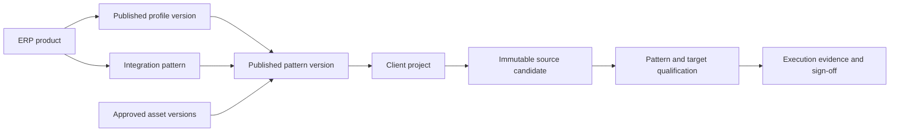

# HighStudio integration patterns

Date: 5 October 2026. This is the current architecture steering record. It supersedes
Oracle-first assumptions in earlier plans; dated evidence remains historical evidence.
It describes code boundaries and required qualification, not a live deployment certificate.

## Product boundary

HighStudio is HighRadius's engineering and qualification control plane for client ERP
integrations. It receives requirements, applies approved intelligence and baselines,
generates reviewable changes, retains human approvals, creates immutable candidates,
and records target-specific execution evidence. Integration runtime belongs to the
selected pattern and its approved target. The product does not imply a HighRadius runtime
SDK, an autonomous agent swarm, or vendor APIs that have not been implemented.

Oracle Fusion Publisher is one integration pattern. It does not define all ERP workflows.
Existing PL/SQL profile versions and historical projects remain intact; their sources
require a separately compatible Oracle database target, rather than Fusion SaaS installation.

## Governed resources

| Resource | Authority |
|---|---|
| `ERPProfile` | Product identity, such as Oracle Fusion Cloud, SAP or Dynamics; catalogue presence alone establishes no connector. |
| `ERPProfileVersion` | Exact published intelligence/workflow configuration reused by a pattern; prompt, knowledge, strategy and validator resolution keep their existing registries. |
| `IntegrationPattern` | HighRadius pattern identity for a product, such as an outbound API, file exchange or Publisher extract. |
| `IntegrationPatternVersion` | Published contract pin: profile version, runtime, direction, deliverable, generation rules, compatibility, adapter bindings, capabilities, qualification policy and test plan. |
| `PatternBaseline` | Association to exact approved `ERPAssetVersion` package records; no duplicate baseline store. |
| Project, candidate, attempt | Exact pattern-version reference and input, source, baseline and environment bindings needed to assess current validity. |



Published pattern content is immutable: changes create a new version; retirement preserves
historical references. New projects choose a published pattern compatible with their
selected product, pinned intelligence, installation edition/version and environment.
A nullable pattern reference preserves older projects, rather than inventing a pattern
pin or rewriting their approvals during migration.

The compiler resolves the exact pattern contract and approved baseline versions, records
checksums and bounded baseline content, and freezes the context into the committed generation
run. Applicable global prompts/guidance retain their existing resolution rules; a pattern
pin does not guarantee future model requests or generated bytes are identical.

The installed `baseline_json` strategy version `1` modifies explicitly allowed named files
from approved text baselines. It preserves other baseline files and rejects undeclared output
names. These source operations do not establish native build, import or execution support.

## Runtime and qualification

| Runtime type | Required qualification follows the actual delivery mechanism |
|---|---|
| `ERP_NATIVE` | Native artifact format/build/import and exact installed identity where those operations are required. |
| `API_INTEGRATION` | Authorized API contract, credentials, request/response behavior and independently checked outputs. |
| `FILE_BASED` | Approved file format and transport, validation, delivery and receipt evidence. |
| `EXTERNAL_RUNTIME` | Explicit compatible runtime, deployment mechanism and execution evidence. |
| `ASSISTED` | Declared human steps and authenticated observations with their actual assurance limits. |

Installation is an optional pattern capability. An API request or file transfer does not
inherit an Oracle package installation gate. Required capabilities, optional capabilities,
supported environments and qualification policy come from the pattern contract. Installed
adapters must independently admit the requested deliverable, runtime, mode and operation.
Selecting a runtime value or publishing configuration installs no adapter.

Client ownership, environment custody, actor authority, current candidate checksum, current
connection/secret configuration, pattern contract, baseline versions, approved test plan and
approval expiry must agree before dispatch. Recheck bindings at completion and sign-off;
changed prerequisites make old results inapplicable while preserving historical evidence.
Private evidence and downloads retain checksums and authenticated parent ownership.

`UNKNOWN_OUTCOME` requires reconciliation, not an automatic duplicate remote write. Typed
failure diagnostics can inform a requested engineering revision; the model cannot alter
assertion expectations, approve work, claim evidence or release a package. No automatic
repair/retest or reusable verified-learning loop is established by a remediation endpoint.

## Publisher slice and evidence limits

- `oracle_simulator` exercises development-only candidate qualification with synthetic CSV
  output. `PUBLISHER_SOURCE` means source files, not a vendor-native `.xdm`/`.xdo` export.
  Simulator receipts and releases remain `SIMULATED`; no native qualification is implied.
- `oracle_fusion_publisher` implements bounded SOAP `hasReportAccess` and `runReport` against
  an explicitly configured existing report. Approved execution attempts can use the existing
  transport; no install, native artifact readback, ESS submission/status/log collection or
  exact generated-candidate identity is currently qualified through it.
- Remote report output can provide `REMOTE_EXECUTION_OBSERVED` and assertion evidence for
  that operation. It cannot satisfy a native-artifact release policy that requires proof of
  installing and executing the exact generated bytes.
- Assisted manual evidence is an authenticated tester attestation, not machine proof of
  remote artifact identity. A pattern demanding higher assurance must block manual release.
- Catalogue families and generic JSON generation are configuration/framework coverage.
  They do not certify live SAP, Workday, Dynamics or other vendor adapters.

## Steering audit of the existing implementation

This audits the current code and earlier implementation approach. It does not attribute the
repository's already modified files to any particular turn or contributor.

| Decision | Work under review | Action |
|---|---|---|
| **KEEP** | Authenticated identity, client ownership, OIDC, private artifacts, audit records and PostgreSQL tenant controls | Preserve throughout pattern work; UI visibility never replaces authorization. |
| **KEEP** | Fixed product shell, Home directory, direct project Studio routes, document intake, exact revisions, review/history and durable generation | Reuse the product paths; committed work survives navigation. |
| **KEEP** | Approved immutable source candidates, version-bound evidence, sign-off and historical downloads | Preserve exact bytes, checksums and source/target lineage. |
| **KEEP** | Existing Publisher SOAP check/report transport and legacy PL/SQL configurations | Retain as specific implemented/compatibility paths with separate target and assurance labels. |
| **KEEP_WITH_REFACTOR** | Profile workflow/intelligence, package validation and execution harness | Add exact pattern/baseline pins and pattern-specific capability policies; retain existing registries and workers. |
| **KEEP_WITH_REFACTOR** | Oracle-shaped generic orchestration, source extraction and validation compatibility | Keep old contracts usable; isolate future behavior behind configured strategies/adapters. |
| **KEEP_WITH_REFACTOR** | Development Publisher fixture and simulator | Keep explicit synthetic fixtures and bounded worker checks; label source/native/simulated states accurately. |
| **REMOVE** | Universal install requirements, Publisher as the product definition, or inferred runtime support from ERP names/file extensions | Remove those architectural assumptions and UI claims. Do not delete historical data. |
| **REMOVE** | Simulated PASS presented as live/vendor-native qualification; invented HighRadius SDK or vendor deployment APIs | Remove claims; keep actual evidence and declared missing capabilities. |
| **NOT_YET_IMPLEMENTED** | Qualified native Publisher build/import/readback, ESS operations, broad vendor adapters and production fan-in/fan-out destination runtime | Require real approved baseline assets, protocols, targets and independently checked evidence. |
| **NOT_YET_IMPLEMENTED** | Autonomous repair/retest, verified learning promotion and full live/operational qualification | Do not equate current review feedback, mock checks or release attestations with these capabilities. |

## Migrations and explicit local fixtures

Retain `20261005_01_execution_harness.py`. Add `20261005_02_integration_patterns.py` with
`down_revision = 20261005_01`; do not replace or rewrite migration history to disguise the
architecture change. The new migration adds pattern tables and nullable references on
projects, package candidates and execution attempts. PostgreSQL policies/immutability
triggers require PostgreSQL verification; fresh SQLite checks cannot certify them.

Commands below are examples for a new disposable local database, not instructions to
migrate an existing customer database. Run from `backend/`, with locked dependencies
already installed. The explicit seed requires `APP_ENV=development`; normal API startup,
reads and health checks must not seed or repair the schema.

```sh
export APP_ENV=development
export DATABASE_URL=sqlite+aiosqlite:////private/tmp/highstudio-pattern-fixture.db
export LLM_PROVIDER=mock
export DEMO_MODE=true
export EXECUTION_SIMULATOR_ENABLED=true
uv run --no-sync python -m app.cli development-init
uv run --no-sync python -m app.cli seed --manifest oracle-publisher-harness-v1
uv run --no-sync python -m app.cli.generation_worker --once
uv run --no-sync python -m app.cli.execution_worker --once
```

The fixture's product key is `oracle-fusion-cloud`. Its historical manifest name is retained.
Seeding preserves existing governed product/profile/prompt/asset rows. When the Publisher
fixture needs its own intelligence configuration, the explicit command adds a fixture-owned
profile version; it does not mutate an older published version or move historical projects.
The seed's baseline is synthetic and its default pattern policy permits simulation only.
`--once` processes available queued work; it does not create a project, approve a job or
establish a remote environment. Production workers require explicitly provisioned client scope.

Offline checks use a test environment and synthetic data:

```sh
APP_ENV=test LLM_PROVIDER=mock DEMO_MODE=true GROQ_API_KEY= ERP_ADMIN_API_KEY= \
  uv run --no-sync pytest -q -m 'not postgres'
uv run --no-sync python scripts/check_quality.py
```

Keep the quality ledger unchanged when fixing introduced diagnostics. Record actual check
counts separately. Fresh SQLite migration/offline fixture success establishes local behavior
only. PostgreSQL isolation, live authorized ERP/Bedrock operations and production readiness
remain pending until their specific evidence exists. See [local verification](local-verification.md).

## Remaining rename inventory

A filename-only/match-only search excluded real environment files, storage, logs, build output,
dependency caches and Git metadata; no credential values were inspected or printed.

| Class | Remaining examples | Treatment |
|---|---|---|
| `LEGACY_INTERNAL_IDENTIFIER` | `render.yaml`, `Dockerfile`, `deployment/aws/`, `compose.test.yaml`, CI, Alembic/config defaults, Python distribution name | Keep operational identifiers; no name migration is authorized. |
| `BACKWARD_COMPATIBILITY` | `ERPFUSION_MANAGED`, `ERPFUSION_SANDBOX`, OIDC transaction storage key, ZIP/evidence format markers and deterministic fixture IDs | Preserve stored contracts; do not blindly replace strings or migrate names. |
| `HISTORICAL_MIGRATION` | No old product-name occurrence found in current migration source | Preserve historical revision and table identifiers. |
| `DOCUMENTATION_REQUIRING_HISTORY` | Dated plans/evidence, legacy helper docstrings and earlier mock download naming | Keep historical context clear; do not rewrite prior records. |

The product title is **HighStudio**. Author attribution belongs only in the HTML head metadata.
External font/resource requests were removed before the branding phase. Keep them removed;
do not claim their removal as a change from the current `HEAD`. Legacy internal identifiers
are not additional product brands.

```yaml
Visible product name: HighStudio
HTML title: HighStudio
HTML author metadata: Srikara Krishna Vuyyuru
Author visible in UI: No
```

The branding edits retain the favicon, viewport and module-script loading. No preload or
preconnect resources existed in the entry point at the start of this branding phase.

## Verification recorded on 5 October 2026

| Check | Result | What it establishes |
|---|---|---|
| Backend suite | 322 passed; 12 skipped | Offline lifecycle, pattern/baseline provenance, approval, target policy, simulator, assisted release, seed compatibility and migration regression checks. PostgreSQL-specific checks skipped without `TEST_POSTGRES_URL`. |
| Frontend unit suite | 71 passed across 17 files | Component interactions and permission/assurance controls with fixtures. |
| Browser fixture suite | 14 passed | Fixed header/sidebar/footer, bounded long JSON and permission controls in desktop and compact viewports; API responses are fixtures. |
| Full-stack browser suite | 2 passed | Actual React/FastAPI, fresh disposable SQLite migrations, private storage, prompt compiler and durable generation/execution workers; model output and ERP execution are explicitly simulated. |
| Quality, type checks, frontend build | Passed | Introduced diagnostics do not exceed the existing ledgers; inherited backend diagnostics remain. |

The full-stack Publisher test creates the product, stage prompts, published source baseline,
integration pattern, client, installation, TEST environment and project through the Admin UI.
It uploads a requirement, generates and explicitly approves each stage, prepares the candidate,
authorizes capabilities, separately approves its execution, checks candidate-bound evidence,
signs a **simulated** release and downloads the ZIP. No ERP profile is preseeded for that test,
and non-loopback browser requests are blocked.

The backend also verifies that a target changed during dispatch supersedes the result while
retaining evidence, that malformed test contracts fail at the boundary, and that assisted
observations cannot satisfy a higher-assurance release policy. New PostgreSQL checks cover
published pattern/baseline immutability and bounded HTTP/worker actor-role rechecks, but their
runtime behavior remains unverified until a dedicated test database is supplied.

These results do **not** qualify native Oracle import, exact remote artifact read-back, real
Oracle execution, other vendor adapters, a HighRadius runtime SDK or production deployment.

## Source map

- [Pattern registry](../../backend/app/api/integration_patterns.py),
  [models](../../backend/app/models/integration_pattern.py),
  [baseline resolution](../../backend/app/services/integration_patterns.py).
- [Prompt compiler](../../backend/app/services/prompt_compiler.py),
  [generation strategies](../../backend/app/services/codegen/strategies.py).
- [Execution contracts](../../backend/app/services/execution_contracts.py),
  [orchestration](../../backend/app/services/execution.py),
  [adapters](../../backend/app/services/execution_adapters.py),
  [attempt routes](../../backend/app/api/executions.py).
- [Package source/release service](../../backend/app/services/packages.py),
  [existing Publisher transport](../../backend/app/services/erp_connections.py).
